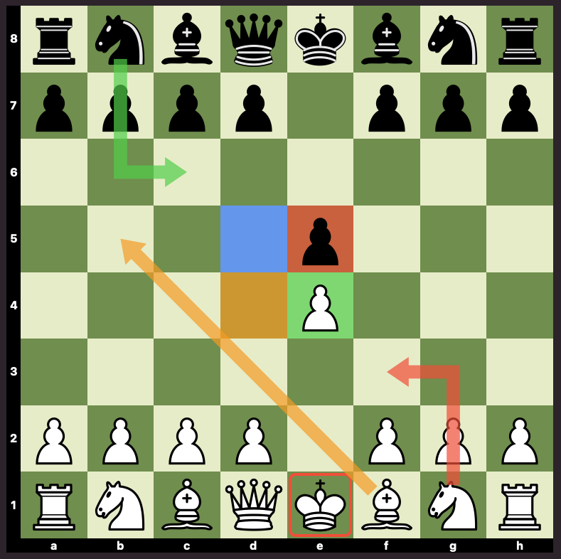
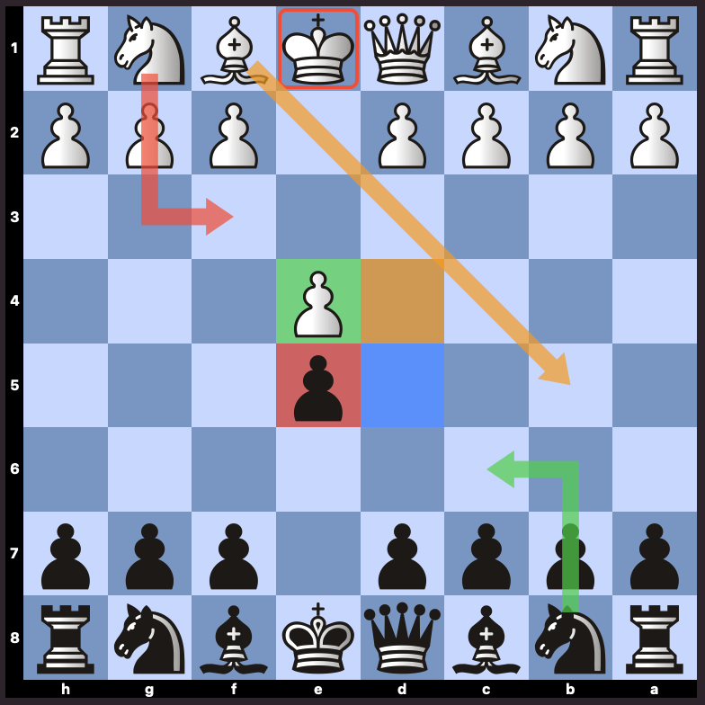

# ChessBoard

A SwiftUI ChessBoard supporting iOS and macOS.
It does not know the chess rules, enforcing them is on the user.

## Features:
- moving pieces by dragging them
- selecting and highlighting cells
- drawing arrows
- custom board design
- custom piece set
- custom decorations over squares and the whole board

## Screenshots

